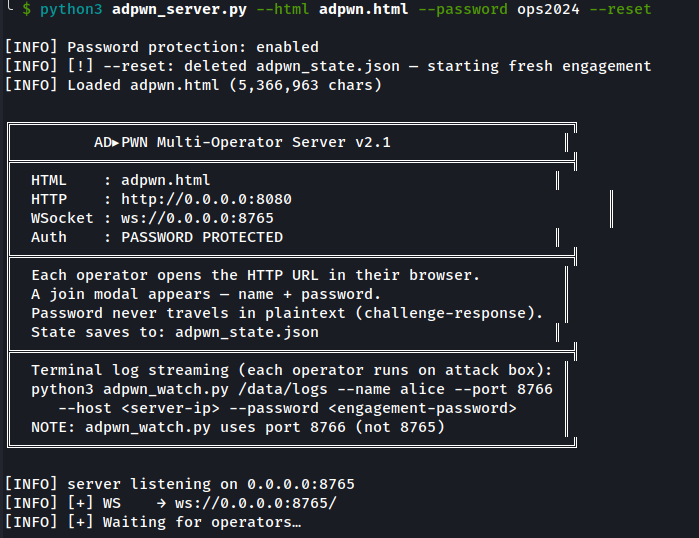
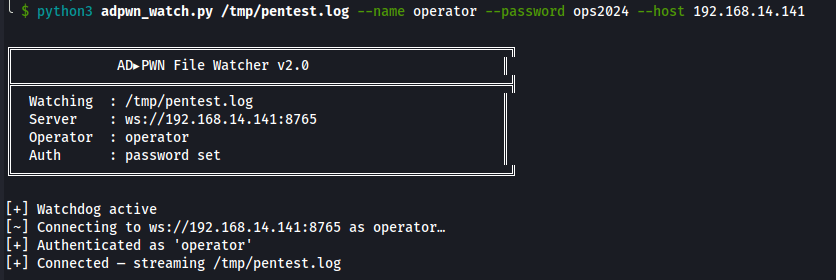
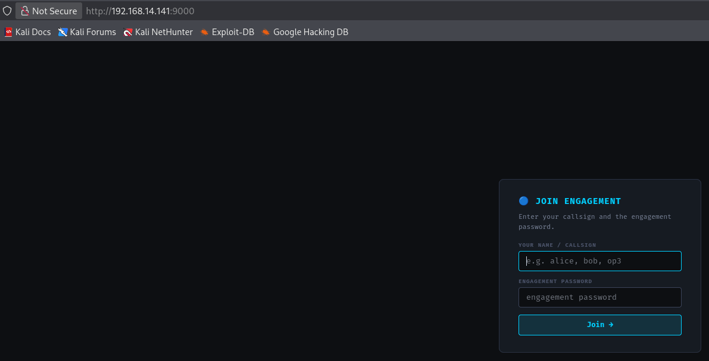
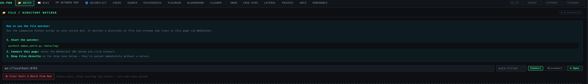
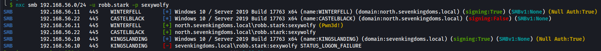
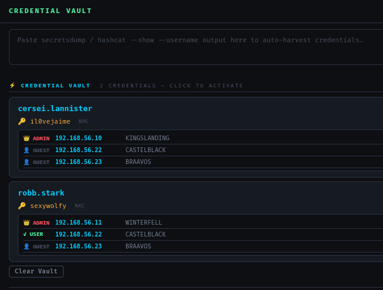
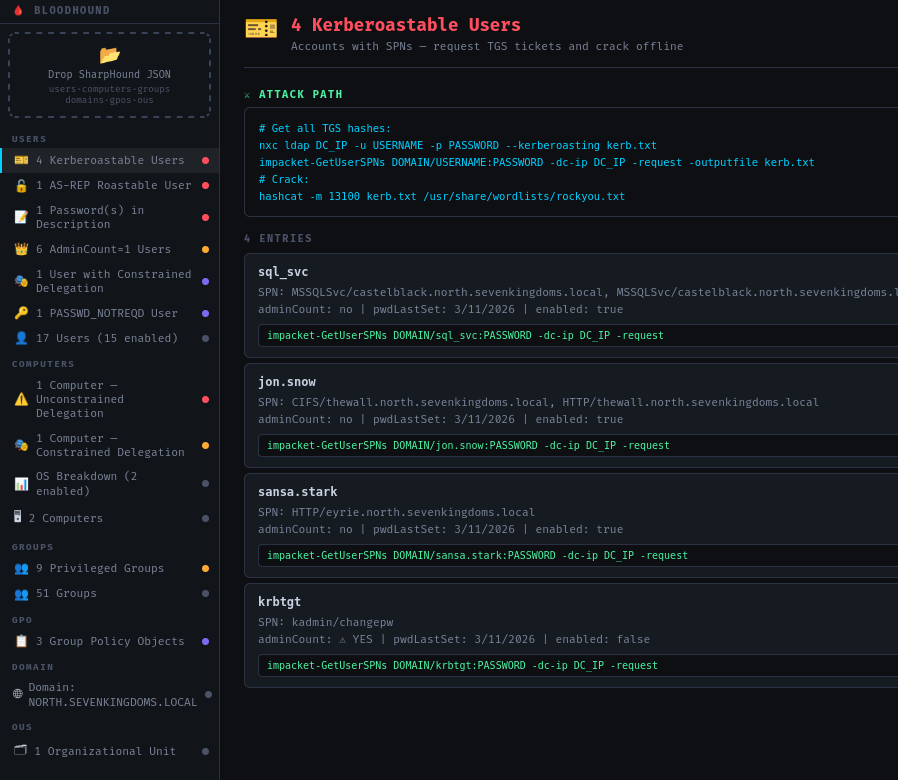
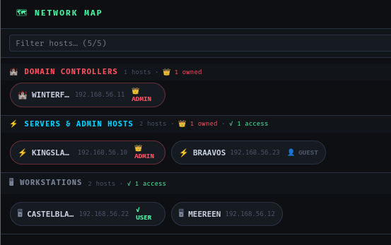
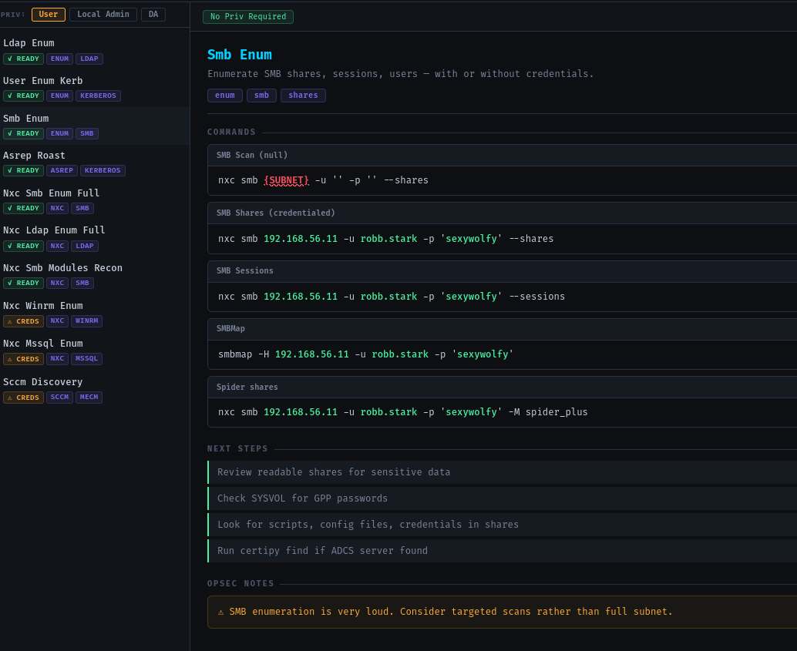
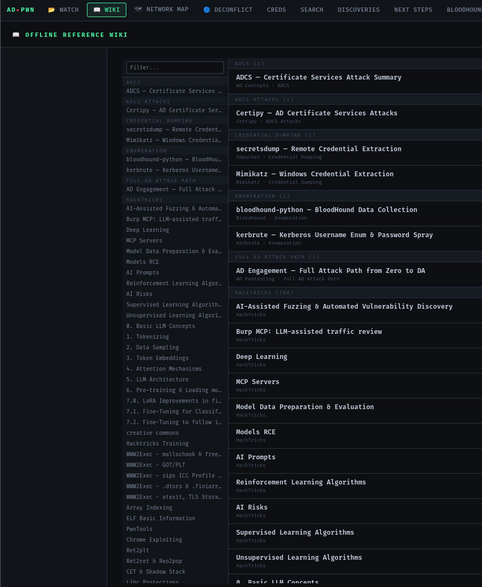

# ADPwn_Helper
Self contained Active Directory Helper

## Starting Server:

This has been updated, screenshots may not reflect

```python3 adpwn_bake.py --html adpwn.html --attacks yaml/upload_attacks.yaml```



You can also change which port the server starts on

```python3 adpwn_server.py --html adpwn.html --password ops2024 --http-port 9000```

## Starting Script:

A script must be started on each new terminal, you can also use a directory if you already have logs.

```script -f /tmp/pentest.log```

## Starting Client:

Host is IP address of server

```python3 adpwn_watch.py /tmp/pentest.log --name operator --password ops2024 --host 192.168.14.141```



## Using tool

Go to web page:



Put in your username and the password that the server has on it

Go to watch and press connect



You are now connected to the server and the log file that you have created is now being watched.

Now that you have everything running, run a command with NetExec and see that information is auto filled:





## Bloodhound

Import bloodhound JSON files and you will see important information



## Network Map

Network map will try to map out the network for you, when running a subnet, or on a single machine it will auto-update as needed



## Enum and other tabs

Double clicking on a user within the creds tab will auto-fill other tabs for you to be able to use



You can also add in more information within the cred vault to help with auto-fill

## Custom Commands

You can insert your own custom commands using the Command Template and add_commands.py 

## Wiki

The Wiki is offline and built into the HTML, you can input your own wiki utilizing the add_wiki.py with a yaml file


